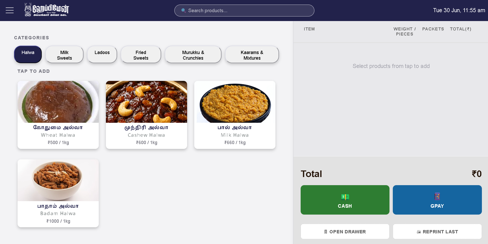
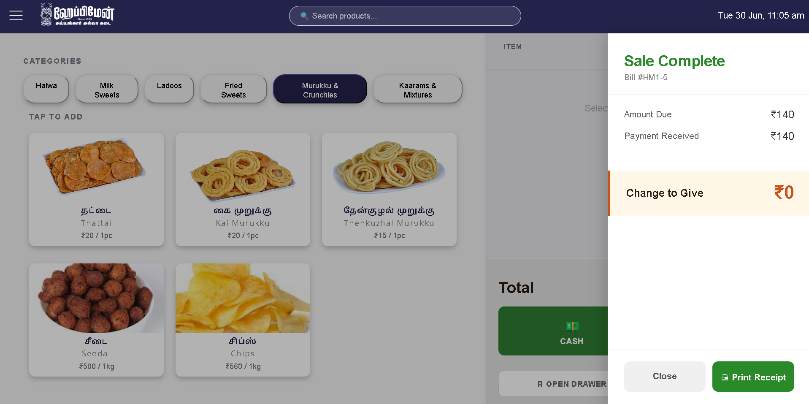

# HappyMan POS

A local-first, bilingual point-of-sale system built for HappyMan Sweets, a family-run
sweet shop business operating two locations in Tamil Nadu, India. Runs entirely offline
as a packaged Windows application, with cloud sync planned for multi-shop reporting.

This is both a real product (in use by my family) and a portfolio project demonstrating
end-to-end application development, relational database design, packaging and release
engineering, and BI reporting.

---

## Why this project exists

My father runs two traditional sweet shops in India. Like most small Indian retailers,
daily sales are tracked on paper, prices are memorised by staff, and reporting at
month-end means manually flipping through ledger books.

Off-the-shelf POS solutions (Vyapar, Marg, PetPooja) didn't fit because:

- Staff speak Tamil; most software is English-only
- Products are sold by weight, pieces, AND packets simultaneously
- Shop has unreliable internet — cloud-only POS would block sales during outages
- Subscription fees over multiple years exceed a custom-build cost

So I built one. Offline-first, bilingual, tuned to the shop's actual workflow.

---

## Current state

### Working today

- Touch-friendly cart organised by category, with Tamil + English labels on every product
- Flexible quantities — sells products by weight, pieces, or packets in one cart
- Cash + GPay payments with denomination shortcut buttons (₹100, ₹200, ₹500) for fast tender
- Server-side bill numbering with shop prefix (HM1-1, HM1-2, etc.) — designed for GST compliance
- Void / cancel with a reason, using an append pattern that preserves the original record
- Transaction history with lazy-loaded line items
- Excel export with multi-sheet reports (Summary, Sales List, Items Detail)
- Backend status indicator and offline handling — payment is blocked rather than failing silently
- Persistent SQLite storage; survives reboots and machine changes
- Packaged as a Windows installer and released through GitHub Releases

### Planned

- HTTP Basic authentication on all endpoints
- Rotating file logs for remote debugging
- Automated database backups
- Void pattern analysis (frequency by reason, by time of day)
- Cloud sync via Supabase for consolidated multi-shop reporting

---

## Analytics and reporting

The POS writes Excel reports to a local folder. On top of that sits a reporting layer
built separately from the application:

- **Power Query pipeline** pointed at the report folder as its source, so new sales files
  are picked up automatically as they are generated
- **Staging queries** hold the raw exports untouched (load disabled); cleaning and shaping
  happen in downstream queries that reference them
- **DAX measures**, pivot tables and charts over the resulting model

The result is a dashboard that refreshes as new exports land, with no manual rebuild
between periods. The separation between raw and transformed data means the underlying
export format can change without breaking the presentation layer.

---

## Architecture


The application is a single executable. Double-clicking it starts a local web server and
opens Chrome in app mode — no address bar, no tabs, so it behaves like a desktop
application. The user never sees a terminal or installs Python.

Each shop runs its own independent copy with its own database.

---

## Snap Shots




## Tech stack

**Frontend:** Vanilla HTML, CSS, and JavaScript. No framework. Intentional choice — the UI
is simple enough that React or Vue would have been overkill, and vanilla JS forced me to
learn the fundamentals properly.

**Backend:** Python, FastAPI for routing, Pydantic for runtime validation of incoming sale
data, uvicorn as the ASGI server. Static files are served by FastAPI in production, so the
whole application runs from one process.

**Database:** SQLite, one file per shop, stored in the user's AppData directory. Schema
designed for analytical queries — foreign keys, normalised sales and sale_items tables,
and void columns built in from the start.

**Reporting:** openpyxl for Excel generation. Excel with Power Query and DAX for the
dashboard layer.

**Packaging:** PyInstaller bundles the application, its dependencies, the frontend, and the
SQL schema into a single executable. Inno Setup wraps that in a Windows installer that
creates Start Menu shortcuts and an uninstaller. Versions are published as GitHub Releases.

**Planned infrastructure:** Supabase as a cloud destination for consolidated reporting.
Each shop continues to operate offline-first; sync is never on the critical path for a sale.

---

## Installation (end users)

1. Download the latest installer from the [Releases](https://github.com/devayani24/happyman-pos/releases) page
2. Place `seed_data.json` — which contains the shop's product catalogue and categories —
   next to the installer, or in the application data folder
3. Run the installer
4. Launch HappyMan POS from the Start Menu

On first launch the application copies the seed file into its data directory, creates the
SQLite database, and loads the product catalogue. Subsequent launches skip setup and open
straight to the sale screen.

`seed_data.json` is not distributed with the installer — it contains shop-specific pricing
and is supplied separately.

---

## Running from source

### Prerequisites

- Python 3.10+ (recommended via Conda)
- Git

### Setup

```bash
git clone https://github.com/devayani24/happyman-pos.git
cd happyman-pos

conda create -n happyman python=3.10
conda activate happyman
pip install -r requirements.txt

# Creates the SQLite database and loads the product catalogue
python -m app.db.setup_db

# Start the app the way the packaged version does
python run_app.py
```

`run_app.py` handles first-run setup, starts uvicorn, and opens the browser. To run just
the API for development:

```bash
uvicorn app.main:app --reload --port 8000
```

Interactive API documentation is available at `http://localhost:8000/docs`.

### Building the installer

```bash
rmdir /s /q build dist
pyinstaller HappyManPos.spec
```

The executable appears in `dist/`. The Inno Setup script then packages it into an
installer for release.

---

## Engineering decisions worth explaining

### Local-first, not cloud-first

The shop's internet is unreliable. A cloud-only POS would block sales whenever the
connection drops. Local SQLite keeps the system running offline; cloud sync is layered on
top for consolidated reporting, but is never required to complete a sale.

### Backend as the source of truth

The browser holds no durable state. Every sale is validated, numbered, and written
server-side before the UI reports success. An earlier version kept cart state in
localStorage, which looked like persistence but didn't survive a device change — moving
the authority to the backend removed a whole class of bugs.

### Atomic transaction handling

An early bug produced the worst possible failure mode: the UI showed "sale failed" while
the sale was actually in the database. The save function was writing in three steps, each
committing immediately, and a failure in the final step left the first two persisted. The
fix was to prepare everything first — generate the bill number, gather the data, validate —
then write it all in a single transaction that either commits or rolls back entirely.

Now a failure message can be trusted, which matters because the alternative is staff
re-entering a sale that already saved.

### Voids append rather than delete

Cancelling a sale never removes a row. The original is flagged with a timestamp and a
reason, and an offsetting entry is written alongside it. Nothing is destroyed, so the
records stay auditable and the reasons themselves become analysable — a void pattern by
time of day or by staff member is worth knowing about.

The UI says "cancelled" rather than "void", because "void" is a database word, not a word
anyone at a shop counter uses.

### Server-side bill number generation

Bill numbers are assigned by the server at the moment of save, not computed on the client.
This prevents collisions when multiple devices submit sales — a real bug hit during
testing — and ensures the database is the single source of truth for bill sequencing.
Numbers are continuous per shop, which is required for GST compliance in India.

### Two-table sales schema

Sales and sale_items are separated rather than stored as nested JSON in one row, so
analytical questions — top products by month, average ticket size, peak hours — are
ordinary SQL joins rather than parsing exercises. The schema was designed for the
reporting layer from the start, not retrofitted for it.

### Packaged as an installer, not a repository

The people using this cannot open a terminal, and shouldn't have to. PyInstaller bundles
Python, the dependencies, the frontend, and the schema into one file; Inno Setup makes it
installable the way any other Windows program is. Distributing through GitHub Releases
means an update is a download, not a support call.

The hardest part was not the bundling itself but path handling: read-only resources are
extracted to a temporary directory at runtime, while the database and reports must live in
a persistent location. Getting that separation wrong produces an application that works on
the development machine and fails everywhere else.

---

## What I learned building this

- **HTTP is the protocol, not the internet.** Browser-to-localhost talks HTTP exactly as
  browser-to-Amazon does.
- **CORS is a server-side opt-in.** It can't be bypassed in the browser, and CORS errors
  frequently mask a real backend error — check the server log first.
- **Pydantic catches at the door.** Most "the data is weird" bugs disappear when the API
  has a strict contract.
- **Silent failures are the worst kind.** A success message in the UI does not mean the
  data reached the database.
- **Prepare everything before writing anything.** This changed how I write code generally,
  not just this project.
- **Store money as integers.** This project uses floating-point for currency, which works
  at this scale but accumulates rounding error. The inventory system I'm building now
  stores paise as integers instead.
- **SQLite's `datetime('now')` returns UTC.** Local timestamps need to be generated
  explicitly.
- **Bundling is its own discipline.** An application that runs from source is perhaps
  halfway to an application someone else can install.
- **Design before you code.** Thirty minutes sketching the Excel structure saved hours of
  refactoring.

---

## Related project

[HappyMan Inventory](https://github.com/devayani24/happyman-inventory) — a companion
application tracking raw material deliveries from suppliers and settlement of supplier
accounts. Together the two systems capture both revenue and cost, which makes per-product
profitability answerable for the first time.

---

## Author

**Devayani Senthilvelan**

Master of Data Science, RMIT University, Melbourne. Background in biomedical engineering
and data analytics. Building this for my family's business while preparing for a career in
data analytics.

Currently seeking data analyst roles in Melbourne, with a focus on retail and commercial
analytics.

- LinkedIn: [devayani-senthilvelan](https://www.linkedin.com/in/devayani-senthilvelan/)
- GitHub: [devayani24](https://github.com/devayani24)
- Email: devayanisenvel@gmail.com